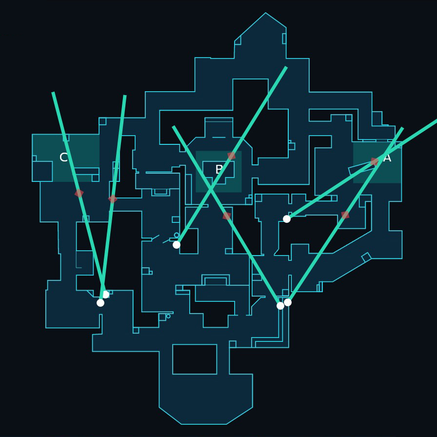
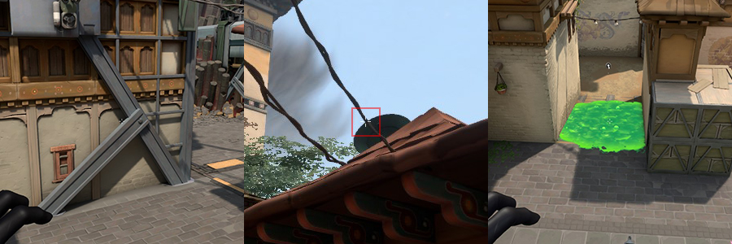

# Haven

&nbsp;  
&nbsp;  
## Attack

&nbsp;  
### Walls

&nbsp;  

&nbsp;  
### A Site - Orbs

&nbsp;  

&nbsp;  
### A Site - Lineups (*Post-Plant*)

&nbsp;  

&nbsp;  

&nbsp;  

&nbsp;  
### A Site - Ults

&nbsp;  

&nbsp;  
### B Site - Orbs

&nbsp;  

&nbsp;  
### B Site - Linups (*Post-Plant*)

&nbsp;  

&nbsp;  

### C Site - Orb

&nbsp;  

### C Site - Orb (*Post-Plant*)

&nbsp;  

### C Site - Linups (*Post-Plant*)

&nbsp;  

&nbsp;  

&nbsp;  

&nbsp;  
&nbsp;  
## Defense

&nbsp;  
### Walls

&nbsp;  

&nbsp;  
### A Site - Orbs

&nbsp;  

&nbsp;  

&nbsp;  
### A Site - Lineups (*Retake*)

&nbsp;  

&nbsp;  

&nbsp;  

&nbsp;  
### C Site - Orbs

&nbsp;  

&nbsp;  

&nbsp;  
### C Site - Lineups (*Retake*)

&nbsp;  