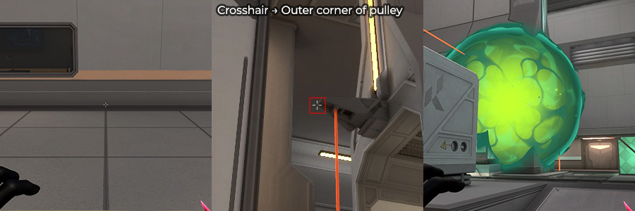
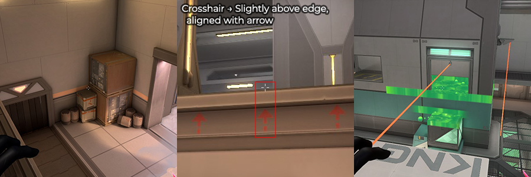
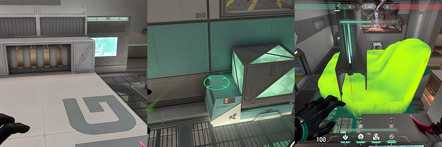
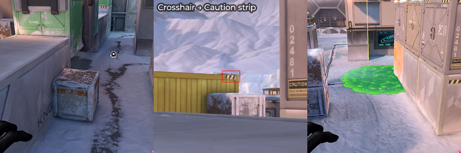
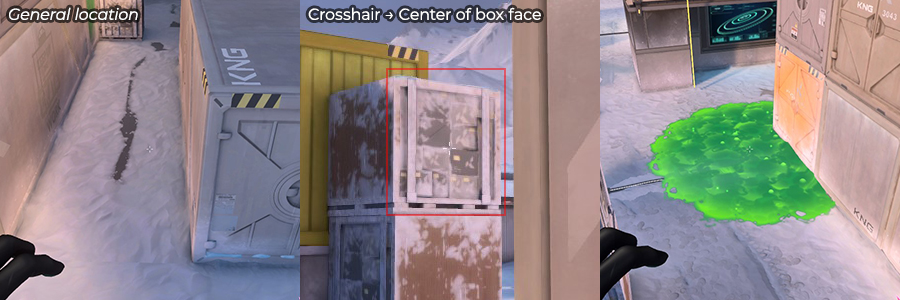
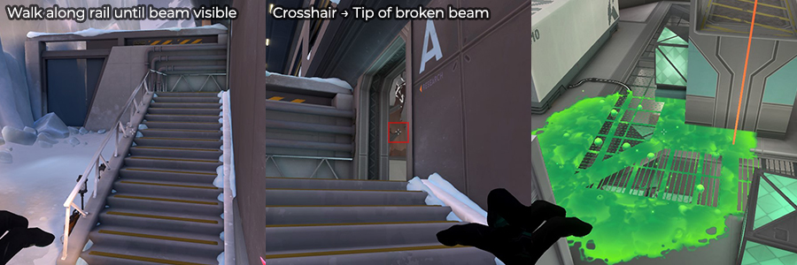
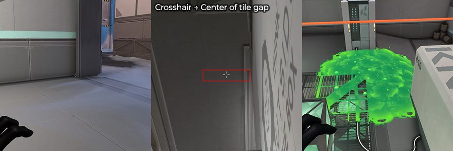

# Icebox

&nbsp;  
&nbsp;  
## Attack

&nbsp;  
### Walls

&nbsp;  

&nbsp;  
### A Site - Orbs

&nbsp;  

&nbsp;  
### A Site - Lineups (*Entry*)

&nbsp;  

&nbsp;  
### A Site - Lineups (*Post-Plant*)

**Location placement is more important than cursor placement**

**Better to have wall aimed above rafters (so wall is ontop of box)**
&nbsp;  

&nbsp;  
### A Site - Ults (*Post-Plant*)

&nbsp;  

&nbsp;  
### B Site - Lineups (*Post-Plant*)

&nbsp;  

&nbsp;  

&nbsp;  
&nbsp;  
## Defense

&nbsp;  
### A Site - Orbs

&nbsp;  

&nbsp;  
### A Site - Lineups (*Retake*)

&nbsp;  

&nbsp;  